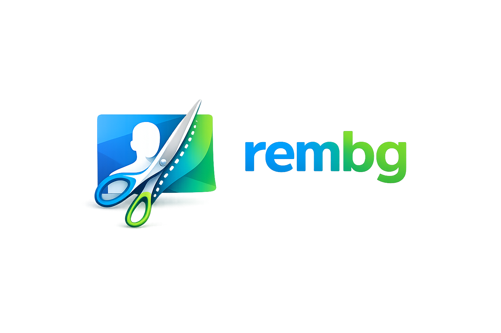
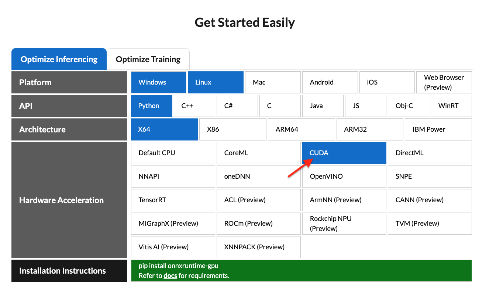

<p align="center">
  
</p>

<div align="center">
  <p align="center">Rembg is a tool to remove image backgrounds. It can be used as a CLI, Python library, HTTP server, or Docker container.</p>
  <div style="display: flex; flex-direction: row; justify-content: center; gap: 8px; flex-wrap: wrap; margin-top: 8px;">
    <a href="https://img.shields.io/badge/License-MIT-blue.svg"></a>
    <a href="https://huggingface.co/spaces/KenjieDec/RemBG"></a>
    <a href="https://bgremoval.streamlit.app/"></a>
    <a href="https://colab.research.google.com/github/danielgatis/rembg/blob/main/rembg.ipynb"></a>
    <a href="https://repomapr.com/danielgatis/rembg"></a>
  </div>
</div>

<br/>

<p align="center">
    <a href="https://trendshift.io/repositories/2846" target="_blank">
        
    </a>
</p>

## Sponsors

<table>
 <tr>
    <td align="center" vertical-align="center">
      <a href="https://photoroom.com/api/remove-background?utm_source=rembg&utm_medium=github_webpage&utm_campaign=sponsor" >
        
      </a>
    </td>
    <td align="center" vertical-align="center">
      <b>PhotoRoom Remove Background API</b>
      <br />
      <a href="https://photoroom.com/api/remove-background?utm_source=rembg&utm_medium=github_webpage&utm_campaign=sponsor">https://photoroom.com/api</a>
      <br />
      <p width="200px">
        Fast and accurate background remover API<br/>
      </p>
    </td>
  </tr>
</table>

**If this project has helped you, please consider making a [donation](https://www.buymeacoffee.com/danielgatis).**

## Requirements

```text
python: >=3.11, <3.14
```

## Installation

Choose **one** of the following backends based on your hardware:

### CPU support

```bash
pip install "rembg[cpu]" # for library
pip install "rembg[cpu,cli]" # for library + cli
```

### GPU support (NVIDIA/CUDA)

First, check if your system supports `onnxruntime-gpu` by visiting [onnxruntime.ai](https://onnxruntime.ai/getting-started) and reviewing the installation matrix.

<p style="display: flex;align-items: center;justify-content: center;">
  
</p>

If your system is compatible, run:

```bash
pip install "rembg[gpu]" # for library
pip install "rembg[gpu,cli]" # for library + cli
```

> **Note:** NVIDIA GPUs may require `onnxruntime-gpu`, CUDA, and `cudnn-devel`. See [#668](https://github.com/danielgatis/rembg/issues/668#issuecomment-2689830314) for details. If `rembg[gpu]` doesn't work and you can't install CUDA or `cudnn-devel`, use `rembg[cpu]` with `onnxruntime` instead.

### GPU support (AMD/ROCm)

ROCm support requires the `onnxruntime-rocm` package. Install it by following [AMD's documentation](https://rocm.docs.amd.com/projects/radeon/en/latest/docs/install/native_linux/install-onnx.html).

Once `onnxruntime-rocm` is installed and working, install rembg with ROCm support:

```bash
pip install "rembg[rocm]" # for library
pip install "rembg[rocm,cli]" # for library + cli
```

## Usage as a CLI

After installation, you can use rembg by typing `rembg` in your terminal.

The `rembg` command has 4 subcommands, one for each input type:

- `i` - single files
- `p` - folders (batch processing)
- `s` - HTTP server
- `b` - RGB24 pixel binary stream

You can get help about the main command using:

```shell
rembg --help
```

You can also get help for any subcommand:

```shell
rembg <COMMAND> --help
```

### rembg `i`

Used for processing single files.

**Remove background from a remote image:**

```shell
curl -s http://input.png | rembg i > output.png
```

**Remove background from a local file:**

```shell
rembg i path/to/input.png path/to/output.png
```

**Specify a model:**

```shell
rembg i -m u2netp path/to/input.png path/to/output.png
```

**Return only the mask:**

```shell
rembg i -om path/to/input.png path/to/output.png
```

**Apply alpha matting:**

```shell
rembg i -a path/to/input.png path/to/output.png
```

**Pass extra parameters (SAM example):**

```shell
rembg i -m sam -x '{ "sam_prompt": [{"type": "point", "data": [724, 740], "label": 1}] }' examples/plants-1.jpg examples/plants-1.out.png
```

**Pass extra parameters (custom model):**

```shell
rembg i -m u2net_custom -x '{"model_path": "~/.u2net/u2net.onnx"}' path/to/input.png path/to/output.png
```

### rembg `p`

Used for batch processing entire folders.

**Process all images in a folder:**

```shell
rembg p path/to/input path/to/output
```

**Watch mode (process new/changed files automatically):**

```shell
rembg p -w path/to/input path/to/output
```

### rembg `s`

Used to start an HTTP server.

```shell
rembg s --host 0.0.0.0 --port 7000 --log_level info
```

For complete API documentation, visit: `http://localhost:7000/api`

**Remove background from an image URL:**

```shell
curl -s "http://localhost:7000/api/remove?url=http://input.png" -o output.png
```

**Remove background from an uploaded image:**

```shell
curl -s -F file=@/path/to/input.jpg "http://localhost:7000/api/remove" -o output.png
```

### rembg `b`

Process a sequence of RGB24 images from stdin. This is intended to be used with programs like FFmpeg that output RGB24 pixel data to stdout.

```shell
rembg b <width> <height> -o <output_specifier>
```

**Arguments:**

| Argument | Description |
|----------|-------------|
| `width` | Width of input image(s) |
| `height` | Height of input image(s) |
| `output_specifier` | Printf-style specifier for output filenames (e.g., `output-%03u.png` produces `output-000.png`, `output-001.png`, etc.). Omit to write to stdout. |

**Example with FFmpeg:**

```shell
ffmpeg -i input.mp4 -ss 10 -an -f rawvideo -pix_fmt rgb24 pipe:1 | rembg b 1280 720 -o folder/output-%03u.png
```

> **Note:** The width and height must match FFmpeg's output dimensions. The flags `-an -f rawvideo -pix_fmt rgb24 pipe:1` are required for FFmpeg compatibility.

## Usage as a Library

**Input and output as bytes:**

```python
from rembg import remove

with open('input.png', 'rb') as i:
    with open('output.png', 'wb') as o:
        input = i.read()
        output = remove(input)
        o.write(output)
```

**Input and output as a PIL image:**

```python
from rembg import remove
from PIL import Image

input = Image.open('input.png')
output = remove(input)
output.save('output.png')
```

**Input and output as a NumPy array:**

```python
from rembg import remove
import cv2

input = cv2.imread('input.png')
output = remove(input)
cv2.imwrite('output.png', output)
```

**Force output as bytes:**

```python
from rembg import remove

with open('input.png', 'rb') as i:
    with open('output.png', 'wb') as o:
        input = i.read()
        output = remove(input, force_return_bytes=True)
        o.write(output)
```

**Batch processing with session reuse (recommended for performance):**

```python
from pathlib import Path
from rembg import remove, new_session

session = new_session()

for file in Path('path/to/folder').glob('*.png'):
    input_path = str(file)
    output_path = str(file.parent / (file.stem + ".out.png"))

    with open(input_path, 'rb') as i:
        with open(output_path, 'wb') as o:
            input = i.read()
            output = remove(input, session=session)
            o.write(output)
```

For more examples, see the [examples](USAGE.md) page.

## Usage with Docker

### CPU Only

Replace the `rembg` command with `docker run danielgatis/rembg`:

```shell
docker run -v .:/data danielgatis/rembg i /data/input.png /data/output.png
```

### NVIDIA CUDA GPU Acceleration

**Requirements:** Your host must have the [NVIDIA Container Toolkit](https://docs.nvidia.com/datacenter/cloud-native/container-toolkit/latest/install-guide.html) installed.

CUDA acceleration requires `cudnn-devel`, so you need to build the Docker image yourself. See [#668](https://github.com/danielgatis/rembg/issues/668#issuecomment-2689914205) for details.

**Build the image:**

```shell
docker build -t rembg-nvidia-cuda-cudnn-gpu -f Dockerfile_nvidia_cuda_cudnn_gpu .
```

> **Note:** This image requires ~11GB of disk space (CPU version is ~1.6GB). Models are not included.

**Run the container:**

```shell
sudo docker run --rm -it --gpus all -v /dev/dri:/dev/dri -v $PWD:/data rembg-nvidia-cuda-cudnn-gpu i -m birefnet-general /data/input.png /data/output.png
```

**Tips:**

- You can create your own NVIDIA CUDA image and install `rembg[gpu,cli]` in it.
- Use `-v /path/to/models/:/root/.u2net` to store model files outside the container, avoiding re-downloads.

## Models

All models are automatically downloaded and saved to `~/.u2net/` on first use.

### Available Models

- u2net ([download](https://github.com/danielgatis/rembg/releases/download/v0.0.0/u2net.onnx), [source](https://github.com/xuebinqin/U-2-Net)): A pre-trained model for general use cases.
- u2netp ([download](https://github.com/danielgatis/rembg/releases/download/v0.0.0/u2netp.onnx), [source](https://github.com/xuebinqin/U-2-Net)): A lightweight version of u2net model.
- u2net_human_seg ([download](https://github.com/danielgatis/rembg/releases/download/v0.0.0/u2net_human_seg.onnx), [source](https://github.com/xuebinqin/U-2-Net)): A pre-trained model for human segmentation.
- u2net_cloth_seg ([download](https://github.com/danielgatis/rembg/releases/download/v0.0.0/u2net_cloth_seg.onnx), [source](https://github.com/levindabhi/cloth-segmentation)): A pre-trained model for Cloths Parsing from human portrait. Here clothes are parsed into 3 category: Upper body, Lower body and Full body.
- silueta ([download](https://github.com/danielgatis/rembg/releases/download/v0.0.0/silueta.onnx), [source](https://github.com/xuebinqin/U-2-Net/issues/295)): Same as u2net but the size is reduced to 43Mb.
- isnet-general-use ([download](https://github.com/danielgatis/rembg/releases/download/v0.0.0/isnet-general-use.onnx), [source](https://github.com/xuebinqin/DIS)): A new pre-trained model for general use cases.
- isnet-anime ([download](https://github.com/danielgatis/rembg/releases/download/v0.0.0/isnet-anime.onnx), [source](https://github.com/SkyTNT/anime-segmentation)): A high-accuracy segmentation for anime character.
- sam ([download encoder](https://github.com/danielgatis/rembg/releases/download/v0.0.0/vit_b-encoder-quant.onnx), [download decoder](https://github.com/danielgatis/rembg/releases/download/v0.0.0/vit_b-decoder-quant.onnx), [source](https://github.com/facebookresearch/segment-anything)): A pre-trained model for any use cases.
- birefnet-general ([download](https://github.com/danielgatis/rembg/releases/download/v0.0.0/BiRefNet-general-epoch_244.onnx), [source](https://github.com/ZhengPeng7/BiRefNet)): A pre-trained model for general use cases.
- birefnet-general-lite ([download](https://github.com/danielgatis/rembg/releases/download/v0.0.0/BiRefNet-general-bb_swin_v1_tiny-epoch_232.onnx), [source](https://github.com/ZhengPeng7/BiRefNet)): A light pre-trained model for general use cases.
- birefnet-portrait ([download](https://github.com/danielgatis/rembg/releases/download/v0.0.0/BiRefNet-portrait-epoch_150.onnx), [source](https://github.com/ZhengPeng7/BiRefNet)): A pre-trained model for human portraits.
- birefnet-dis ([download](https://github.com/danielgatis/rembg/releases/download/v0.0.0/BiRefNet-DIS-epoch_590.onnx), [source](https://github.com/ZhengPeng7/BiRefNet)): A pre-trained model for dichotomous image segmentation (DIS).
- birefnet-hrsod ([download](https://github.com/danielgatis/rembg/releases/download/v0.0.0/BiRefNet-HRSOD_DHU-epoch_115.onnx), [source](https://github.com/ZhengPeng7/BiRefNet)): A pre-trained model for high-resolution salient object detection (HRSOD).
- birefnet-cod ([download](https://github.com/danielgatis/rembg/releases/download/v0.0.0/BiRefNet-COD-epoch_125.onnx), [source](https://github.com/ZhengPeng7/BiRefNet)): A pre-trained model for concealed object detection (COD).
- birefnet-massive ([download](https://github.com/danielgatis/rembg/releases/download/v0.0.0/BiRefNet-massive-TR_DIS5K_TR_TEs-epoch_420.onnx), [source](https://github.com/ZhengPeng7/BiRefNet)): A pre-trained model with massive dataset.
- bria-rmbg ([download](https://github.com/danielgatis/rembg/releases/download/v0.0.0/bria-rmbg-2.0.onnx), [source](https://huggingface.co/briaai/RMBG-2.0)): A state-of-the-art background removal model by BRIA AI.

## FAQ

### When will this library support Python version 3.xx?

This library depends on [onnxruntime](https://pypi.org/project/onnxruntime). Python version support is determined by onnxruntime's compatibility.

## Support

If you find this project useful, consider buying me a coffee (or a beer):

<a href="https://www.buymeacoffee.com/danielgatis" target="_blank"></a>

## Star History

[](https://star-history.com/#danielgatis/rembg&Date)

## License

Copyright (c) 2020-present [Daniel Gatis](https://github.com/danielgatis)

Licensed under the [MIT License](./LICENSE.txt).
